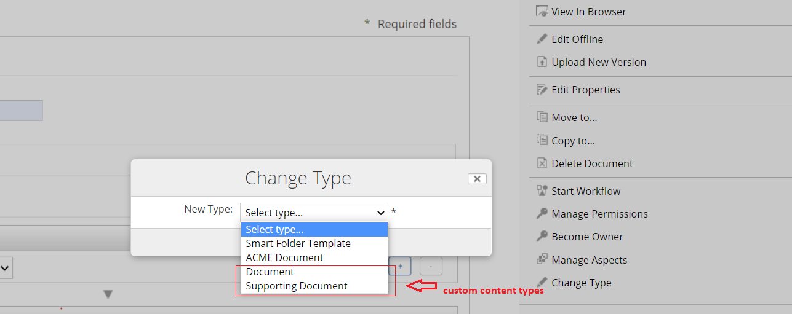

# specialize-type-demo
Demo project for change/specialize type on custom content/folder types

#### Visit this Post for step by step implementation details: https://javaworld-abhinav.blogspot.com/2020/06/change-type-of-custom-content-types.html

This is an All-In-One (AIO) project for Alfresco SDK 4.1.

Run with `./run.sh build_start` or `./run.bat build_start` and verify that it

 * Runs Alfresco Content Service (ACS)
 * Runs Alfresco Share
 * Runs Alfresco Search Service (ASS)
 * Runs PostgreSQL database
 * Deploys the JAR assembled modules
 
All the services of the project are now run as docker containers. The run script offers the next tasks:

 * `build_start`. Build the whole project, recreate the ACS and Share docker images, start the dockerised environment composed by ACS, Share, ASS and 
 PostgreSQL and tail the logs of all the containers.
 * `build_start_it_supported`. Build the whole project including dependencies required for IT execution, recreate the ACS and Share docker images, start the 
 dockerised environment composed by ACS, Share, ASS and PostgreSQL and tail the logs of all the containers.
 * `start`. Start the dockerised environment without building the project and tail the logs of all the containers.
 * `stop`. Stop the dockerised environment.
 * `purge`. Stop the dockerised container and delete all the persistent data (docker volumes).
 * `tail`. Tail the logs of all the containers.
 * `reload_share`. Build the Share module, recreate the Share docker image and restart the Share container.
 * `reload_acs`. Build the ACS module, recreate the ACS docker image and restart the ACS container.
 * `build_test`. Build the whole project, recreate the ACS and Share docker images, start the dockerised environment, execute the integration tests from the
 `integration-tests` module and stop the environment.
 * `test`. Execute the integration tests (the environment must be already started).

- Examples:
  - Create a rule via manage rules:
    

        
       
        
    

  - Change type from a content or folder:
    

        
       
       
        
    

